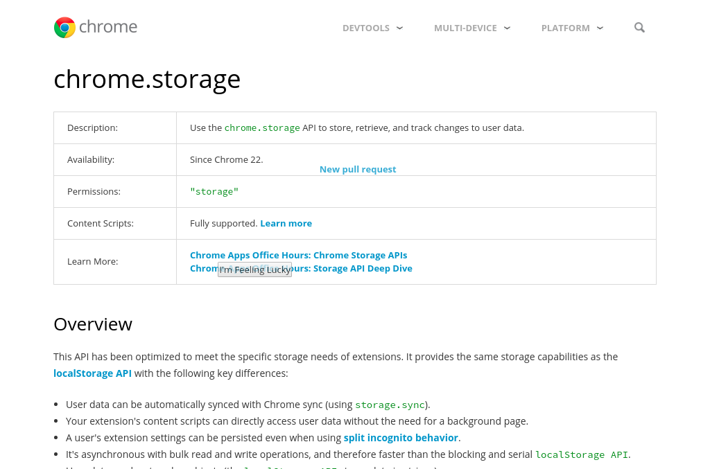

Browse History
====

[Screen Recording](https://vimeo.com/253825121)

Sometimes you'd like to escape your browsing history, but like memories, they
follow you to unexpected places. As they try to fit themselves to new situations,
you might forget where they came from. Faint and fading, these remnants of your browsing
circulate in your pages subconscious.

## What works
- Open a few tabs, click between them

## What doesn't work
- Having multiple windows open at the same time. Only one please!

## Goal
The goal was a prototype of the idea. From a technical standpoint, this is pretty inefficient.  
If you are looking for a code sample, please look elsewhere ([like here](https://github.com/austince/image-processing)).

## Structure
`src` contains the extension to be packed and loaded. Both the `background.js`
and `content.js` are bundled with their dependencies.